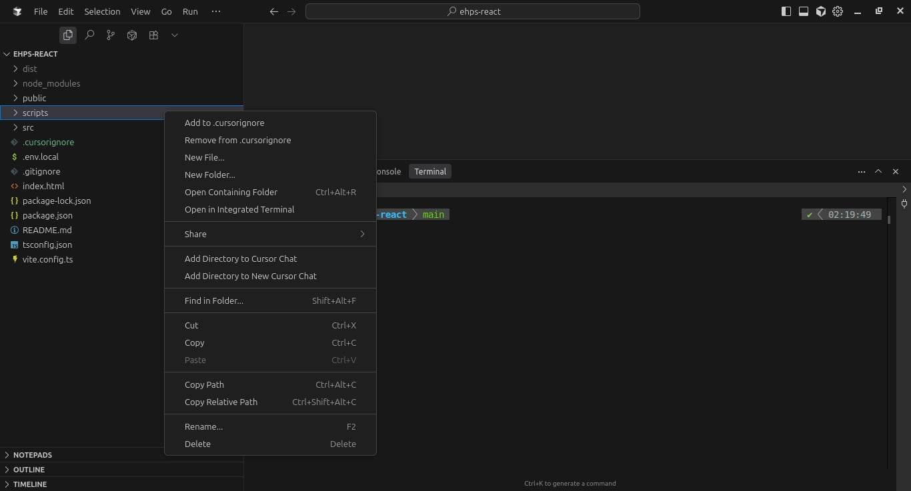

## cursorignore-helper

[](./LICENSE)


A lightweight Cursor/VS Code extension to manage `.cursorignore` entries straight from the Explorer or Command Palette. Keep ignores tidy, reduce noise for AI/code tools, and speed up your workspace.

### Contents
- [Features](#features)
- [Installation](#installation)
- [Quick Start](#quick-start)
- [Screenshots](#screenshots)
- [Usage](#usage)
- [Typical `.cursorignore` entries](#typical-cursorignore-entries)
- [How it works](#how-it-works)
- [Troubleshooting](#troubleshooting)
- [Development](#development)
- [Contributing](#contributing)
- [License](#license)

### Features
- Keep `.cursorignore` organized and readable
- Suggest common ignores for typical projects
 - Works with multi‑select and falls back to the active editor file

### Installation
Option A: Install the packaged VSIX
1. Open Cursor/VS Code → Extensions view
2. Click the ⋯ menu → "Install from VSIX..."
3. Select `cursorignore-helper-1.0.0.vsix`

Option B: Run from source (for development)
1. `npm ci`
2. `npm run compile`
3. Press F5 (Run Extension) in VS Code to start an Extension Host

### Quick Start
1. Open a workspace/folder
2. Select files or folders in the Explorer
3. Right‑click → "Add to .cursorignore" (or use the Command Palette)

### Screenshots
<!-- Add screenshots/GIFs here -->

### Usage
Explorer context menu (recommended):
1. In the Explorer, select one or more files/folders
2. Right‑click → "Add to .cursorignore" or "Remove from .cursorignore"

Command Palette:
1. Open the file in the editor (or select in Explorer)
2. Run "Add to .cursorignore" or "Remove from .cursorignore"

Notes:
- Works with multi‑select in the Explorer
- If nothing is selected, the active editor file is used
- Only items inside a workspace folder are processed
- A `.cursorignore` file is created at the workspace root if missing

### Typical `.cursorignore` entries
```
node_modules/
dist/
build/
.next/
.venv/
*.log
coverage/
tmp/
.cache/
```

### How it works
- Resolves selected URIs and groups them by workspace folder
- Reads the workspace `.cursorignore` (creates it if missing)
- Normalizes entries to paths relative to the workspace root using forward slashes
- Add: appends entry if it does not already exist
- Remove: deletes an exact matching entry
- Writes the updated file with a trailing newline

Commands contributed:
- `cursorignore.add` – Add to `.cursorignore`
- `cursorignore.remove` – Remove from `.cursorignore`

### Troubleshooting
- "No selection detected" — Select files in Explorer or open a file in the editor and re‑run the command.
- "No workspace folder found" — Make sure you have an actual folder/workspace open.
- Paths don’t match — The extension writes paths relative to the workspace root using `/` separators. Ensure your ignore entries match that style.

### Development
- Scripts: `npm run compile` (prepublish), `npm ci` for deps
- Main entry: `out/extension.js` built from `src/extension.ts`
- Activation events: `cursorignore.add`, `cursorignore.remove`

### Contributing
Issues and PRs are welcome. Please ensure changes are well-scoped and documented.

### License
MIT


